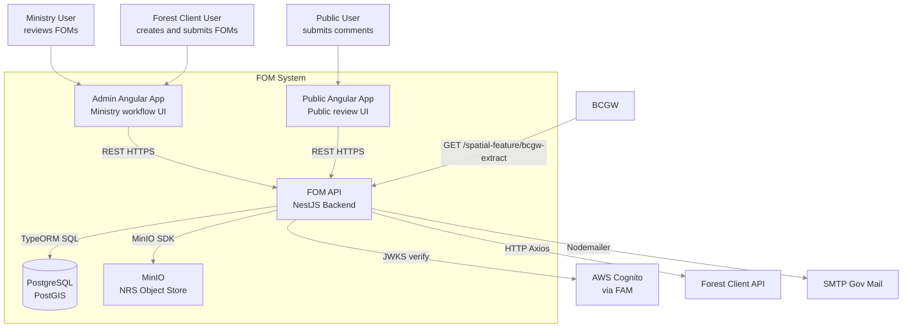
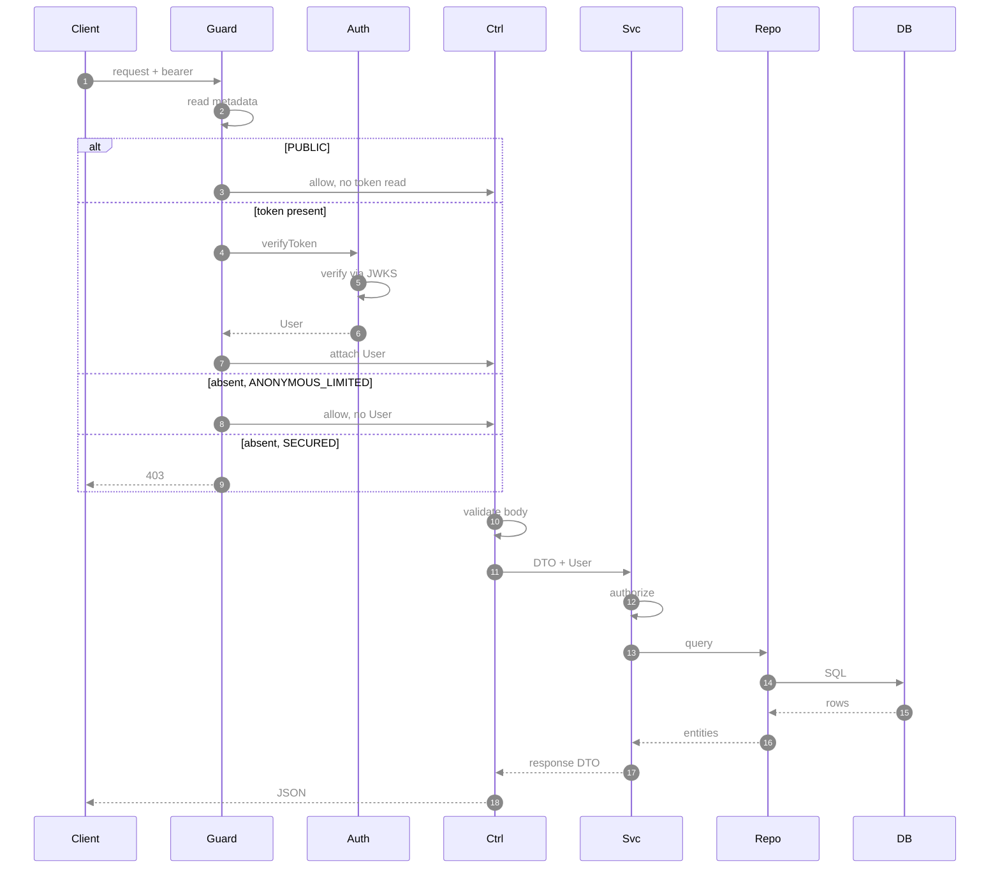
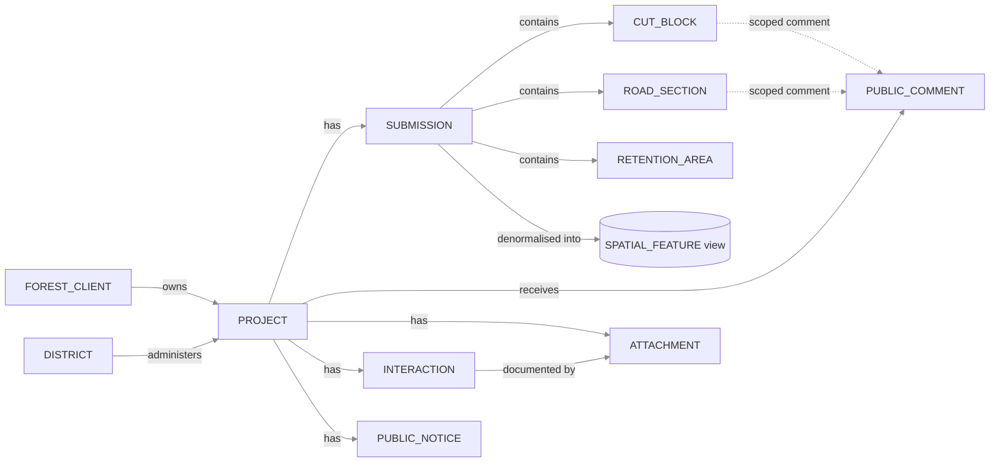

# FOM API Backend Architecture Blueprint

> **Scope:** `api/` NestJS backend
> **Shared dependencies:** `libs/utility/src` (the `User` domain object and shared types)
> **Stack:** NestJS 11 · TypeORM 1.1 · TypeScript 6 · PostgreSQL/PostGIS · AWS Cognito · MinIO Object Storage · Pino · Jest 30
> **Last verified against code:** 2026-08-18

---

## Table of Contents

1. [Architectural Overview](#1-architectural-overview)
2. [C4 Context Diagram](#2-c4-context-diagram)
3. [Component Architecture](#3-component-architecture)
4. [Module Catalog](#4-module-catalog)
5. [Endpoint Inventory](#5-endpoint-inventory)
6. [Data Architecture](#6-data-architecture)
7. [Security Architecture](#7-security-architecture)
8. [Caching Architecture](#8-caching-architecture)
9. [Cross-Cutting Concerns](#9-cross-cutting-concerns)
10. [External Integrations](#10-external-integrations)
11. [Startup & Lifecycle](#11-startup--lifecycle)
12. [Scheduled Work and Batch Jobs](#12-scheduled-work-and-batch-jobs)
13. [Build, Test and Deployment](#13-build-test-and-deployment)
14. [Configuration Reference](#14-configuration-reference)
15. [Extension Guide](#15-extension-guide)
16. [Common Pitfalls](#16-common-pitfalls)

---

## 1. Architectural Overview

The FOM API is a **layered monolith** on NestJS, decomposed by NestJS modules. It combines:

- **Layered architecture** — Controller → Service → Repository within each module.
- **Domain-module grouping** — each business domain (`project`, `submission`, `public-comment`, …) is a self-contained module owning its entities, DTOs, service, and controller.
- **Shared core** — cross-cutting code (security, mail, base entity/service abstractions, Forest Client integration) lives under `api/src/core/` and is imported by feature modules.

The API is also the **source of the frontend contract**: the Swagger document it generates is checked in as `api/openapi/swagger-spec.json` and code-generated into `libs/client/typescript-ng`, which both Angular apps consume.

### Guiding Principles

| Principle | Implementation |
|---|---|
| Single-entry validation | Global `ValidationPipe({ whitelist: true })` strips unknown properties at the HTTP boundary. |
| Opt-in route security | `AuthGuard` is applied **per controller** with `@UseGuards(AuthGuard)`; endpoints then relax it with `@AuthGuardMeta`. Controllers serving only public reference data carry no guard. |
| Deny-by-default service authorization | `DataService`'s four authorization hooks all return `false` in the base class; every concrete service must override the ones it needs. |
| No synchronised schema | TypeORM `synchronize: false` everywhere; schema changes go through versioned migration scripts. |
| Audit trail | Every mutable entity extends `ApiBaseEntity`, providing `create_user`, `create_timestamp`, `update_user`, `update_timestamp`, and `revision_count`. |
| Optimistic locking | `revision_count` is a TypeORM `@VersionColumn`; `DataService.update()` rejects a stale `revisionCount` with `422`. |
| Immutable code tables | Reference tables extend `ApiCodeTableEntity` and are served by `CodeTableService` — read-only, no authorization (assumed public). |
| HTTP cache disabled | A `no-store` middleware applies to every API response. Caching is done in-process instead (see §8). |

---

## 2. C4 Context Diagram



---

## 3. Component Architecture

### Layer Map

```
api/src/
├── main.ts                     ← Bootstrap, migrations, Swagger, middleware, batch dispatch
├── app-constants.ts            ← BatchJobEnum, USER_SYSTEM
├── minio.ts                    ← MinIO client singleton + connection self-test
├── ormconfig.ts                ← TypeORM base config (migrations + runtime)
│
├── app/
│   ├── app.module.ts           ← Root module — TypeORM, Pino, Schedule, all feature modules
│   ├── factories/
│   │   └── mock-logger.factory.ts   ← PinoLogger test double
│   └── modules/
│       ├── analytics-dashboard/     ← Controller only; delegates to project + public-comment
│       ├── app-config/              ← Typed config (Joi-validated)
│       ├── attachment/
│       ├── district/
│       ├── external/                ← External-facing API namespace
│       │   └── projects-by-fsp/
│       ├── forest-client/
│       ├── interaction/
│       ├── project/                 ← Core domain: project, public-notice, workflow, auth
│       ├── public-comment/
│       ├── spatial-feature/         ← Read-only DB view
│       └── submission/
│
├── core/
│   ├── controllers/            ← BaseReadOnlyController, CodeTableController
│   ├── dto/                    ← CodeDto and shared DTO barrel
│   ├── entities/               ← ApiBaseReadOnlyEntity, ApiBaseEntity, ApiCodeTableEntity
│   ├── models/                 ← DataService, DataReadOnlyService, CodeTableService
│   ├── security/               ← AuthGuard, AdminOperationGuard, AuthService,
│   │                             AuthController, SecurityModule, mock-user.factory
│   ├── client-app-integration/ ← Axios client for Forest Client API
│   ├── mail/                   ← MailModule / MailService / mail.config
│   ├── core.module.ts          ← Empty `forRoot` stub; not imported anywhere
│   ├── dateTimeUtil.ts         ← dayjs wrapper, America/Vancouver aware
│   └── utils.ts                ← mapToEntity / mapFromEntity / deepMapKeys / flatDeep
│
├── migrations/
│   ├── main/                   ← 19 schema migrations (.js)
│   ├── test/                   ← 4 test-data seed migrations (.js)
│   ├── ormconfig-migration-main.ts
│   └── ormconfig-migration-test.ts
│
├── assets/aws-cognito-env.json ← Cognito + federated-logout config (ConfigMap-mounted)
├── e2e/app.e2e.spec.ts
└── perftest/
```

### Request Lifecycle



Reading the participants: **Guard** is `AuthGuard`, **Auth** is `AuthService`, **Ctrl** the feature controller, **Svc** its `DataService` subclass, **Repo** the TypeORM repository, **DB** PostgreSQL/PostGIS.

Step detail:

| Step | What actually happens |
|---|---|
| read metadata | `Reflector.getAllAndOverride('authGuardMeta', [handler, class])`; absent ⇒ `SECURED` |
| verifyToken | `AuthService.verifyCognitoToken()` — the bearer is `{"idToken","accessToken"}`, both verified against the Cognito JWKS via `jwks-rsa` |
| attach User | `request.headers['user'] = user` |
| 403 | The guard resolves `false` (it does not throw — throwing surfaces as a 500) |
| validate body | Global `ValidationPipe({ whitelist: true })`; in NestJS pipes run after guards |
| DTO + User | Controller passes the typed DTO and `@UserHeader() user: User` |
| authorize | `isCreateAuthorized` / `isUpdateAuthorized` / `isDeleteAuthorized` / `isViewAuthorized` — deny by default |
| response DTO | `convertEntity()` maps the entity to the response type |

> The guard is **not** global — it runs only for controllers that declare `@UseGuards(AuthGuard)`. See §7.

---

## 4. Module Catalog

### `project` — Core Domain

The central module. It owns the FOM lifecycle and also hosts the project-side analytics aggregations.

| File | Responsibility |
|---|---|
| `project.entity.ts` | `app_fom.project`. PK `project_id`; PostGIS `Point` centroid (`geometry_latlong`, SRID 4326); relations to district, forest client, workflow state code, project plan code; `@OneToMany` submissions and public notices; `comment_classification_mandatory`, `operation_start_year` / `operation_end_year`, `bcts_manager_name`. |
| `project.service.ts` | ~965 lines: CRUD, workflow transitions and their rules, criteria search, public-summary cache, metrics, the daily expiry batch, and four analytics aggregations. |
| `project.controller.ts` | Public summary, detail, search, create, update, delete, workflow-state change, comment-classification change, commenting-closed-date change, metrics. |
| `project-auth.service.ts` | Shared project-level authorization: `isForestClientUserAccess`, `isForestClientUserAllowedStateAccess`, `isAnonymousUserAllowedStateAccess`. |
| `project-auth.module.ts` | Exports `ProjectAuthService`; imported by attachment, public-comment, interaction. |
| `public-notice.entity/service/controller.ts` | `app_fom.public_notice`, one-to-many from project. Own cache + `@Cron` refresh. |
| `workflow-state-code.entity.ts` | Code table + `WorkflowStateEnum`. |
| `project-plan-code.entity.ts` | Code table + `ProjectPlanCodeEnum` (`FSP`, `WOODLOT`). |

**Workflow states** (`WorkflowStateEnum`): `INITIAL`, `PUBLISHED`, `COMMENT_OPEN`, `COMMENT_CLOSED`, `FINALIZED`, `EXPIRED`.

```
INITIAL ──publish──► PUBLISHED ──open comments──► COMMENT_OPEN
                                                        │
                                             ──close comments──► COMMENT_CLOSED
                                                                        │
                                                           ──finalize──► FINALIZED
COMMENT_OPEN   ──expire (daily batch)──► EXPIRED
COMMENT_CLOSED ──expire (daily batch)──► EXPIRED
```

Transition legality is enforced by `validateWorkflowTransitionRules()`, which also checks the acting user's role and the project's dates.

### `submission` — Spatial Submission

Handles GeoJSON spatial data submitted by forest clients. The largest non-project service (~810 lines) and deliberately **not** a thin `DataService` subclass — it does substantial parsing and validation of its own.

| File | Responsibility |
|---|---|
| `submission.entity.ts` | `app_fom.submission`; one-to-many parent of cut blocks, road sections, retention areas. |
| `cut-block.entity.ts` | PostGIS `Polygon`. |
| `road-section.entity.ts` | PostGIS `LineString`. |
| `retention-area.entity.ts` | PostGIS `Polygon`. |
| `submission.service.ts` | Parses GeoJSON, **detects and converts the coordinate reference system**, validates geometry type and required properties per spatial object code, checks coordinates fall within a BC bounding box, replaces existing spatial objects, recomputes area/length, updates the project centroid, and enforces workflow-state constraints via `getPermittedSubmissionTypeCode()`. |
| `submission.controller.ts` | `POST /submission`, `GET /submission/detail/:projectId`, `DELETE /submission/:submissionId`. |

### `spatial-feature` — Spatial Query View

Read-only module over a PostgreSQL **view**, denormalising all shapes for map rendering and BCGW export.

| File | Responsibility |
|---|---|
| `spatial-feature.entity.ts` | `@ViewEntity('spatial_feature', { schema: 'app_fom' })` — geometry and centroid as GeoJSON strings, planned dates/area/length, workflow state, relations to forest client and submission type. |
| `feature-type-code.ts` | `FeatureTypeCode` — a code/description class **not persisted in the database**; values (`cut_block`, `retention_area`, `road_section`) come from the view definition, with a static code→instance registry. |
| `spatial-feature.service.ts` | `findByProjectId()` (public response), `getBcgwExtract()` (all active projects). |
| `spatial-feature.controller.ts` | Both endpoints anonymous; the controller has **no guard**. `bcgw-extract` is gated by a `version=1.0-final` query parameter acting as an informal API key, and logs its own duration. |

### `public-comment` — Public Review

| File | Responsibility |
|---|---|
| `public-comment.entity.ts` | `app_fom.public_comment`; links to project, response code, comment scope code, cut block, road section. |
| `public-comment.service.ts` | Create/read/update with workflow-state and authorization checks, plus the four comment-side analytics aggregations (`getCommentCountByDistrict` / `ByForestClient` / `ByResponseCode` / `ByProject`). Overrides `updateEntity` and `findEntityWithCommonRelations`. |
| `comment-scope-code`, `response-code` | Code tables with their own controllers. |

### `attachment` — File Uploads

| File | Responsibility |
|---|---|
| `attachment.entity.ts` | `app_fom.attachment` — metadata only; binaries live in MinIO. |
| `attachment.service.ts` | Validates file type, enforces the one-public-notice-per-project rule, writes the DB record and uploads to MinIO, streams downloads, deletes both sides. Object key pattern: `{projectId}/{attachmentId}/{fileName}`. |
| `attachment.controller.ts` | Multipart upload, metadata reads, file streaming, delete. Three of its reads are `ANONYMOUS_LIMITED` so the public site can fetch public-notice files. |

### `interaction` — Ministry Interaction Records

Ministry-only engagement records against a project, each optionally carrying an attachment. Full CRUD with all four `DataService` authorization hooks overridden.

### `district` — District Reference

Read-only districts (name, email prefix). The **only** user of `DataReadOnlyService` + `BaseReadOnlyController`.

### `forest-client` — Forest Client Data

Wraps `app_fom.forest_client`, a local cache of the external Forest Client API. `find(forestClientNumbers)` for lookups; `batchClientDataRefresh()` for the nightly upsert.

### `analytics-dashboard` — Reporting

**Controller-only module — there is no `analytics-dashboard.service.ts`.** The controller injects `ProjectService` and `PublicCommentService` and delegates all eight endpoints to aggregation methods living on those two services. `analytics-dashboard-data-filter.ts` holds the shared query-builder filters (`applyFomDateAndStateFilters`, `applyProjectPlanCodeFilter`). Guarded by `@UseGuards(AuthGuard, AdminOperationGuard)` at class level — the only admin-gated controller.

### `app-config` — Configuration

Wraps `@nestjs/config` with a **Joi validation schema**. `AppConfigService` exposes `get(key)` for the `app.*` namespace and `db(key)` for `db.*`, plus `getPort()` and `getGlobalPrefix()` (which honours `INSTANCE_URL_PREFIX`).

### `external` — External API Namespace

`ExternalModule` imports `ProjectsByFspExternalModule`. `GET /external/fom-by-fsp?fspId=` returns projects for an FSP number, validated by a bespoke `PositiveIntPipe`. No guard.

### Core (`api/src/core/`)

#### `SecurityModule`

Provides and exports **`AuthService`** and registers **`AuthController`** (`GET /awsCognitoConfig`). It does **not** provide the guards — `AuthGuard` and `AdminOperationGuard` are `@Injectable()` classes referenced directly in `@UseGuards(...)`, and NestJS instantiates them from the injector of the module whose controller uses them. This is why nearly every feature module imports `SecurityModule`: it is what makes `AuthService` resolvable for `AuthGuard`.

#### `DataService<E, R, O>` (abstract)

The workhorse base class. Provides `create`, `update`, `delete`, `findOne`, `findAllUnsecured`, with:

- **Four authorization hooks** — `isCreateAuthorized`, `isUpdateAuthorized`, `isDeleteAuthorized`, `isViewAuthorized`. All return `false` in the base class. `findAllUnsecured` deliberately performs no check, on the reasoning that access depends on the where-criteria and belongs at the controller.
- **Automatic metadata** — sets `createUser` / `updateUser` from the `User` (or `'Anonymous'`), stamps `updateTimestamp`, and increments `revisionCount`.
- **Optimistic locking** — a `revisionCount` mismatch throws `UnprocessableEntityException` (422) with a refresh-and-retry message.
- **Common relations** — `getCommonRelations()` is merged into every find so entities are shaped consistently across `findOne` / `update` / `findAll`.
- **Override hooks** — `convertDto`, `convertEntity`, `saveEntity`, `updateEntity`, `findEntityForUpdate`, `findEntityWithCommonRelations` (the latter pair exist so services can add encryption/decryption).

`findEntityForUpdate` deliberately loads **without** relations: TypeORM misbehaves on update when an entity has both the id field and the relation field populated.

The class docstring is explicit that a fully custom service is acceptable where this shape does not fit — `SubmissionService` is the cited example.

#### `DataReadOnlyService<E, R>` (abstract)

`findOne` / `findAll` only, no authorization. Used by `district` alone.

#### `CodeTableService<E, R>` (abstract)

Separate base for `ApiCodeTableEntity` tables — `findOne` / `findAll`, mapped through `mapFromEntity`. Used by all five code tables.

#### Base controllers

- `BaseReadOnlyController<E, C>` — wires `findAll()` / `findOne(id)` to a `DataReadOnlyService`. Used by `district`.
- `CodeTableController<E>` — exposes `@Get()` → `findAll()` from a `CodeTableService`. Used by `attachment-type-code`, `workflow-state-code`, `comment-scope-code`, `response-code`, `submission-type-code`.

---

## 5. Endpoint Inventory

All paths are relative to the global prefix (`api` by default; see `getGlobalPrefix()`).

| Controller | Guard | Endpoints |
|---|---|---|
| `project` | `AuthGuard` | `GET /project/publicSummary` **(PUBLIC)** · `GET /project/:id` **(ANONYMOUS_LIMITED)** · `GET /project/metrics/:id` · `GET /project` · `POST /project` · `PUT /project/:id` · `PUT /project/workflowState/:id` · `PUT /project/commentClassification/:id` · `PUT /project/commentingClosedDate/:id` · `DELETE /project/:id` |
| `public-notice` | `AuthGuard` | `GET /public-notice` **(PUBLIC)** · `GET /public-notice/latest/:forestClientId` · `GET /public-notice/:id` · `POST` · `PUT /:id` · `DELETE /:id` |
| `public-comment` | `AuthGuard` | `POST /public-comment` **(PUBLIC)** · `PUT /public-comment/:id` · `GET /public-comment` · `GET /public-comment/:id` |
| `attachment` | `AuthGuard` | `POST /attachment` · `GET /attachment/file/:id` **(ANONYMOUS_LIMITED)** · `GET /attachment/:id` **(ANONYMOUS_LIMITED)** · `GET /attachment` **(ANONYMOUS_LIMITED)** · `DELETE /attachment/:id` |
| `submission` | `AuthGuard` | `POST /submission` · `GET /submission/detail/:projectId` · `DELETE /submission/:submissionId` |
| `interaction` | `AuthGuard` | `POST /interaction` · `GET /interaction` · `PUT /interaction/:id` · `DELETE /interaction/:id` |
| `forest-client` | `AuthGuard` | `GET /forest-client` · `GET /forest-client/:id` **(PUBLIC)** |
| `analytics-dashboard` | `AuthGuard` + `AdminOperationGuard` | `GET /analytics-dashboard/project/count` · `/project/count-by-district` · `/project/count-forest-client` · `/project/count-by-forest-client` · `/public-comment/count-by-district` · `/public-comment/count-by-forest-client` · `/public-comment/count-by-responsecode` · `/public-comment/most-commented-projects` |
| `spatial-feature` | **none** | `GET /spatial-feature?projectId=` · `GET /spatial-feature/bcgw-extract?version=1.0-final` |
| `external` | **none** | `GET /external/fom-by-fsp?fspId=` |
| `district` | **none** | `GET /district` · `GET /district/:id` |
| `auth` | **none** | `GET /awsCognitoConfig` |
| Code tables | **none** | `GET /attachment-type-code` · `/workflow-state-code` · `/comment-scope-code` · `/response-code` · `/submission-type-code` |
| *(outside the prefix)* | — | `GET /health-check` |

---

## 6. Data Architecture

### Entity Hierarchy

```
ApiBaseReadOnlyEntity<M>        (factory helper only, no columns)
  └── ApiBaseEntity<M>          (+ revision_count @VersionColumn,
                                   create/update user + timestamp)
        ├── Project
        ├── PublicNotice
        ├── Submission / CutBlock / RoadSection / RetentionArea
        ├── PublicComment
        ├── Attachment
        ├── Interaction
        ├── ForestClient
        └── District

ApiCodeTableEntity<M>           (code PK + description; SEPARATE hierarchy —
  ├── WorkflowStateCode          it does not extend ApiBaseReadOnlyEntity)
  ├── ProjectPlanCode
  ├── SubmissionTypeCode
  ├── AttachmentTypeCode
  ├── CommentScopeCode
  └── ResponseCode

@ViewEntity
  └── SpatialFeature            (app_fom.spatial_feature DB view)

(plain class, not persisted)
  └── FeatureTypeCode           (codes originate in the view definition)
```

### Core Entity Relationships



Solid edges are foreign keys; dotted edges are the optional comment scoping (`public_comment.scope_cut_block_id` / `scope_road_section_id`, set when a commenter targets one shape rather than the whole FOM).

Not every edge above is a TypeORM relation. `Interaction` declares `projectId` and `attachmentId` as plain `@Column`s with no `@ManyToOne`, so those two links exist in the schema but must be joined manually — `InteractionService` does exactly that.

### Schema Conventions

- **Schema:** `app_fom` for all application tables. The migration tracking tables live in `public`.
- **Primary keys:** named `{table}_id`, declared in each concrete entity (`@PrimaryGeneratedColumn('increment', { name: 'project_id' })`) — `ApiBaseEntity` deliberately does not declare the PK, because the column name differs per table.
- **Timestamps:** `timestamptz`.
- **Dates:** business dates (`commenting_open_date`, `commenting_closed_date`) are `date`, not timestamps — timezone handling goes through `DateTimeUtil` with `America/Vancouver`.
- **Spatial columns:** PostGIS `geometry` with explicit `spatialFeatureType` and SRID 4326.
- **Audit columns:** `revision_count`, `create_user`, `create_timestamp`, `update_user`, `update_timestamp`.

### Migrations

- **Main** (`migrations/main/`, 19 scripts) — run in every environment at API startup, tracked in `migration_main`.
- **Test** (`migrations/test/`, 4 scripts) — run only when `DB_TESTDATA=true`, tracked separately.
- Scripts are plain **`.js`, not TypeScript**, deliberately: they are copied into `dist` like assets and executed post-build without a compile step.
- Each migration runs in its own transaction (`runMigrations({ transaction: "each" })`) so a failure cannot leave a partial apply.
- All main migrations run before any test migration, regardless of timestamps.
- Config resolves migrations from three locations — the Docker image path (`/app/dist/api/src/migrations/main/*.js`), a local post-build path, and the source tree — so the same config works in every context.

---

## 7. Security Architecture

### Guard application

`AuthGuard` is **not** registered globally — there is no `APP_GUARD` provider anywhere. It is applied per controller:

```typescript
@ApiTags('project')
@UseGuards(AuthGuard)
@Controller('project')
export class ProjectController { ... }
```

Eight controllers declare it (`project`, `public-notice`, `public-comment`, `attachment`, `submission`, `interaction`, `forest-client`, `analytics-dashboard`). The remaining controllers — `spatial-feature`, `external`, `district`, `auth`, and the five code-table controllers — carry **no guard at all** and are open. That is intentional for reference data and the public map feed, but it means **adding a new controller does not make it secure by default**: the `@UseGuards(AuthGuard)` line is what does.

### Authentication Flow

```
Request to a guarded controller
    │
    ▼
AuthGuard.canActivate()
    │  reads @AuthGuardMeta via Reflector (handler first, then class)
    │
    ├─ GUARD_OPTIONS.PUBLIC ──────────► allow, no token read
    │
    ├─ Authorization header present ──► AuthService.verifyToken()
    │       │
    │       ├─ valid ──► request.headers['user'] = User; allow
    │       └─ invalid ──► resolve(false) → NestJS returns 403
    │
    ├─ No header + ANONYMOUS_LIMITED ─► allow (endpoint implements public logic)
    │
    └─ No header + SECURED (default) ─► resolve(false) → 403
```

The guard resolves `false` rather than throwing, because throwing from a NestJS guard surfaces as a 500 instead of a 403.

### Token verification (`AuthService`)

The bearer token is **not a bare JWT** — it is a JSON object carrying both Cognito tokens:

```
Authorization: Bearer {"idToken":"<jwt>","accessToken":"<jwt>"}
```

`verifyCognitoToken()` decodes each without verifying to read its `kid`, fetches the matching signing key from the Cognito JWKS endpoint via `jwks-rsa` (cached, rate-limited), verifies both signatures with `jsonwebtoken.verify()`, and builds the `User` from the pair via `User.convertAwsCognitoDecodedTokenToUser()` — display name and username from the **ID** token, roles from `cognito:groups` on the **access** token.

When `SECURITY_ENABLED=false` (local dev only), the token is parsed directly as a serialized `User` with no verification at all.

### `GET /awsCognitoConfig`

`AuthController` serves the whole `AwsCognitoConfig` — user pool, client id, OAuth redirect URLs, **and the `logout` block** (Siteminder URL, Keycloak URL, and the per-IdP Keycloak client ids) that the admin SPA uses to build its federated logout chain. The JSON is mounted from an OpenShift ConfigMap into `api/src/assets/aws-cognito-env.json`.

### Authorization model

| User type | Create project | Update/delete project | Read all projects | Read own projects | Submit spatial data | Review comments | Analytics |
|---|---|---|---|---|---|---|---|
| Forest client | Yes (own clients) | Yes (own clients, allowed states) | No | Yes | Yes (own clients, allowed states) | No | No |
| Ministry | No | No | Yes | Yes | No | Yes | No |
| Admin | No | No | — | — | No | No | **Yes** |
| Anonymous | No | No | Public summary only | No | No | Submit only | No |

Enforcement is layered:
1. **Route** — `AuthGuard` / `AdminOperationGuard` / `@AuthGuardMeta`.
2. **Controller** — e.g. `ProjectController.find()` narrows the criteria to `user.clientIds` for a forest-client user and throws `ForbiddenException` if the user is not authorized for the admin site at all.
3. **Service** — `DataService`'s four hooks, plus `ProjectAuthService` for project-scoped checks shared across modules.

### Guards summary

| Guard | Applied to | Behaviour |
|---|---|---|
| `AuthGuard` | 8 controllers, via `@UseGuards` | Validates the Cognito token pair; defaults to `SECURED` when no `@AuthGuardMeta` is present |
| `AdminOperationGuard` | `analytics-dashboard` only | Throws `ForbiddenException` unless `user.isAdmin` |
| `@AuthGuardMeta(GUARD_OPTIONS.PUBLIC)` | Per endpoint | Bypasses the token check entirely |
| `@AuthGuardMeta(GUARD_OPTIONS.ANONYMOUS_LIMITED)` | Per endpoint | Validates if a token is present, allows through if absent; the endpoint must implement the public-versus-authenticated logic itself |

---

## 8. Caching Architecture

HTTP caching is disabled for every response, so caching happens in-process with `node-cache`.

| Cache | Owner | Contents | Refresh |
|---|---|---|---|
| Public summary | `ProjectService` (`new NodeCache({ useClones: false })`) | `findPublicSummaries()` results, keyed by `ProjectFindCriteria.getCacheKey()` | `@Cron('45 9 * * *')` — 09:45 UTC, plus a pre-load at startup |
| Public notices | `PublicNoticeService` | `findForPublicFrontEnd()` results | `@Cron('55 9 * * *')` — 09:55 UTC, plus a pre-load at startup |

The cron times are deliberately staggered behind the workflow-state batch: the OpenShift CronJob flips expired projects at **08:xx UTC**, the project cache refreshes at **09:45**, and the public-notice cache at **09:55**. Changing one time without the others will serve stale public data for up to a day.

`useClones: false` means cached objects are returned **by reference** — callers must not mutate them.

Both caches are also warmed by `postStartup()`, which runs without `await` from `startApi()` so the pod can be marked ready before the warm-up finishes.

---

## 9. Cross-Cutting Concerns

### Logging

- `nestjs-pino` (Pino), bootstrapped with `NestFactory.create(AppModule, { logger: false })` then `app.useLogger(app.get(Logger))`.
- Level from `LOG_LEVEL` (default `info`); timestamps as ISO 8601; level serialized as a label rather than a number.
- Services inject `PinoLogger`; `DataService`'s constructor calls `logger.setContext(this.constructor.name)` so every subclass is tagged automatically.

### Validation

- **Global:** `ValidationPipe({ whitelist: true })` — strips undeclared properties from all request bodies.
- **DTO:** `class-validator` decorators on request DTOs.
- **Config:** Joi schema (`appValidationSchema`) validates environment variables at boot.
- **Business:** services throw `BadRequestException` / `ForbiddenException` / `UnprocessableEntityException`.
- **Parameters:** `ParseIntPipe`, `DefaultValuePipe`, and the custom `PositiveIntPipe` for the external API.

### Error Handling

NestJS's default exception filter maps thrown exceptions to status codes:

| Exception | HTTP |
|---|---|
| `BadRequestException` | 400 |
| `ForbiddenException` | 403 |
| `NotFoundException` | 404 |
| `UnprocessableEntityException` | 422 (used for the optimistic-lock conflict) |
| `InternalServerErrorException` | 500 |

The admin frontend's error interceptor is written against exactly this matrix.

### HTTP Security Headers

`helmet` with `crossOriginResourcePolicy`, `crossOriginOpenerPolicy`, `crossOriginEmbedderPolicy` and `contentSecurityPolicy` enabled, `originAgentCluster` disabled. `x-powered-by` is removed via `httpAdapter.disable("x-powered-by")`.

### CORS

Disabled unless `BYPASS_CORS=true`, which enables `origin: '*'` — local development only. The OpenShift deployment sets it to `"false"` explicitly.

### Request Size Limits

`json` and `urlencoded` bodies capped at **30 MB**, needed for spatial GeoJSON payloads.

### API Documentation

Swagger UI is served **at the global prefix itself** (`/api`), not a sub-path — `SwaggerModule.setup(appConfig.getGlobalPrefix(), app, document)`. The JSON document at `/api-json` is the source for `api/openapi/swagger-spec.json` and hence for the generated Angular client.

---

## 10. External Integrations

### AWS Cognito (via FAM)

- Config from `api/src/assets/aws-cognito-env.json`, ConfigMap-mounted in OpenShift.
- `SECURITY_ENABLED=false` bypasses verification for local dev.
- `jwks-rsa` fetches and caches signing keys; `jsonwebtoken.verify()` verifies both tokens.

### Forest Client API

- `ClientAppIntegrationModule` registers `HttpModule` asynchronously with `baseURL`, `timeout`, and an `X-API-KEY` header, all from `AppConfigService`.
- `ClientAppIntegrationService` pages through non-individual clients (`CLIENT_API_BTH_PAGE_SIZE`, default 1000).
- Results are upserted into `app_fom.forest_client` as a local cache, driven by the `batchClientDataRefresh` job.

### MinIO / NRS Object Store

- `minio.ts` builds a module-level singleton client from `OBJECT_STORAGE_URL` / `_ACCESS_ID` / `_SECRET`, defaulting the endpoint so unit tests and batch runs do not fail at import.
- It calls `verifyObjectStorageConnection()` **at import time**, logging bucket count or an error — a startup self-test that runs as a side effect of the module being loaded.
- `AttachmentService` uses `putObject` / `getObject` / `removeObject`; keys follow `{projectId}/{attachmentId}/{fileName}`.

### SMTP / District Email

- `MailModule` configures `@nestjs-modules/mailer` from `getMailConfig()`; it is imported by `ProjectModule` (not the root module).
- `MailService.sendDistrictNotification()` fires when a FOM is finalized.
- Recipient is `project.district.email + "@gov.bc.ca"` in production, overridden wholesale by `FOM_EMAIL_NOTIFY` in lower environments. Links are built from `HOSTNAME`, defaulting to `http://localhost:4200`.

### BCGW

Pull-based: BCGW calls `GET /spatial-feature/bcgw-extract?version=1.0-final`. The version string doubles as an informal API key and a version handle.

---

## 11. Startup & Lifecycle

`main.ts` chooses one of four entry paths from `process.argv[2]`:

| Argument | Path |
|---|---|
| `-batchWorkflowStateChange` | `runBatch()` → `ProjectService.batchDateBasedWorkflowStateChange()`, then `process.exit(0)` |
| `-batchForestClientDataRefresh` | `runBatch()` → `ForestClientService.batchClientDataRefresh()`, then `process.exit(0)` |
| `-testdata` | `standaloneRunTestDataMigrations()` — test-data migrations out-of-band, to keep them off the normal startup path |
| *(none)* | `startApi()` |

### `startApi()` sequence

```
bootstrap()
 1. Run main DB migrations              (own DataSource, transaction: "each"; exit 1 on failure)
 2. Log v8.getHeapStatistics()
 3. Create Nest app, attach Pino logger
 4. Global ValidationPipe (whitelist)
 5. setGlobalPrefix()                   (INSTANCE_URL_PREFIX aware)
 6. 30 MB body limits (json + urlencoded)
 7. CORS                                (only if BYPASS_CORS=true)
 8. disable x-powered-by
 9. helmet
10. Cache-Control no-store middleware
11. GET /health-check                   (outside the prefix)
12. Swagger at the global prefix
13. app.listen(port)

postStartup()   ← NOT awaited, so the pod is marked ready first
14. Test-data migrations                (only if DB_TESTDATA=true)
15. ProjectService.refreshCache()
16. PublicNoticeService.refreshCache()
```

Migration failure returns `null` from `bootstrap()` and exits `1`. A failure inside `postStartup()` is logged but does **not** stop the process — the API serves with cold caches.

### Health Check

`GET /health-check` sits outside the `/api` prefix and returns `200` with a plain-text body. Used by the OpenShift probes.

---

## 12. Scheduled Work and Batch Jobs

Two mechanisms, running on different clocks:

### In-process `@Cron` (via `ScheduleModule.forRoot()`)

| Job | Schedule (UTC) | Purpose |
|---|---|---|
| `ProjectService.resetCache()` | `45 9 * * *` | Rebuild the public-summary cache |
| `PublicNoticeService.resetCache()` | `55 9 * * *` | Rebuild the public-notice cache |

These run in **every** replica (`REPLICA_COUNT` defaults to 3 in the manifest), which is correct here because each replica has its own in-process cache.

### OpenShift `CronJob` objects

| Job | Schedule (UTC) | Container args |
|---|---|---|
| `work-flow-state-change-batch` | `${CRON_MINUTES} 8 * * *` | `["-batchWorkflowStateChange"]` |
| `fc-client-data-refresh-batch` | `${CRON_MINUTES} 10 * * *` | `["-batchForestClientDataRefresh"]` |

Each runs the same image as a one-shot pod that exits when done. The ordering — state change at 08:xx, caches at 09:45/09:55, client refresh at 10:xx — is deliberate; see §8.

---

## 13. Build, Test and Deployment

### Scripts

```bash
npm run start:api            # nest start --watch
npm run build:api            # nest build → api/dist
npm run test-unit            # jest --coverage, excluding e2e
npm run test-e2e             # jest --testNamePattern='e2e'
npm run gen:client-api:ng    # openapi-generator → libs/client/typescript-ng
npm run db:migrate-main      # / :revert / :show
npm run db:migrate-test      # / :revert / :show
```

### TypeScript

`module: commonjs`, `target: es2015`, `moduleResolution: node`, decorators + `emitDecoratorMetadata` on. Notably **`strict: false` and `noImplicitAny: false`** — the opposite of the Angular apps, which run fully strict.

Path aliases (`tsconfig.json`, mirrored into Jest via `pathsToModuleNameMapper`):

| Alias | Resolves to |
|---|---|
| `@src/*` | `api/src/*` |
| `@core` | `api/src/core` |
| `@api-core/*` | `api/src/core/*` |
| `@controllers` | `api/src/core/controllers` |
| `@entities` | `api/src/core/entities` |
| `@api-modules/*` | `api/src/app/modules/*` |
| `@utility/*` | `libs/utility/src/*` |

### Testing

- **Jest 30**, `ts-jest`, `testEnvironment: node`, coverage to `coverage/api/`, `jest-sonar-reporter` output.
- `resetMocks: true` and `restoreMocks: true` — mocks and spies reset automatically between tests; do not hand-roll teardown.
- `transformIgnorePatterns` explicitly transforms `jose` and `jwks-rsa` (ESM-only packages).
- **15 unit spec files**; **2 e2e specs** (`e2e/app.e2e.spec.ts`, `analytics-dashboard.controller.e2e-spec.ts`).
- e2e boots the real `AppModule` against a live database with `SECURITY_ENABLED=false`, using `supertest` and `mock-user.factory.ts` (`createFakeForestryUser`, `createFakeMinistryUser`) to forge the bearer payload.
- `app/factories/mock-logger.factory.ts` supplies a `PinoLogger` double for unit tests.

### Container

Two-stage build on Red Hat UBI 8:

```dockerfile
FROM registry.access.redhat.com/ubi8/nodejs-24 AS builder
COPY package.json package-lock.json ./
COPY libs/package.json ./libs/
COPY api/package.json ./api/
RUN npm ci --ignore-scripts               # hoisted workspace install, incl. devDeps to build
COPY libs ./libs
COPY api ./api
RUN npm run build:api
RUN npm ci --ignore-scripts --workspace=api --omit=dev   # lean prod-only runtime tree

FROM registry.access.redhat.com/ubi8/ubi:8.10
# node binary + shared libs copied from the builder; no package manager in the runtime image
ENTRYPOINT ["node", "--max-old-space-size=2048", "./dist/api/src/main.js"]
```

Only the manifests this image needs are copied before `npm ci`; `npm` is pinned to 10.9.4 so the skip-missing-workspaces behaviour is deterministic. Migration directories are copied into `dist` separately, since they are `.js` assets rather than compiled output. Runs as `USER 1001`.

### OpenShift

`api/openshift.deploy.yml` is a Template producing a ConfigMap (`aws-cognito-env.json`), a Deployment (3 replicas, 200Mi request / 2.2Gi limit), a Service, a Route, and the two CronJobs. Secrets (DB password, Forest Client API token) come from secret refs, not template values.

### CI

`.github/workflows/pr-open.yml` builds `api` in the same matrix as the frontends, triggered on changes under `api/` or `libs/`.

---

## 14. Configuration Reference

### Environment Variables

| Variable | Default | Description |
|---|---|---|
| `DB_HOST` | `localhost` | PostgreSQL host |
| `DB_PORT` | `5432` | PostgreSQL port |
| `DB_NAME` | `fom` | Database name |
| `DB_USERNAME` | `postgres` | Database user |
| `DB_PASSWORD` | — | Database password |
| `DB_TESTDATA` | `false` | Run test-data seed migrations at startup |
| `DB_SSL` / `DB_SYNCHRONIZE` | `false` / `false` | Both stay false in every environment |
| `SECURITY_ENABLED` | `true` | `false` bypasses token verification (local dev only) |
| `BYPASS_CORS` | `false` | `true` enables `origin: '*'` (local dev only) |
| `APP_PORT` | `3333` | Listen port |
| `APP_ENV` / `NODE_ENV` | `development` | Joi-validated environment names |
| `INSTANCE_URL_PREFIX` | — | Prefixes the global route path (`/fom` → serves at `/fom/api`) |
| `LOG_LEVEL` | `info` | Pino level |
| `OBJECT_STORAGE_URL` | `nrs.objectstore.gov.bc.ca` | MinIO endpoint |
| `OBJECT_STORAGE_BUCKET` | — | Target bucket |
| `OBJECT_STORAGE_ACCESS_ID` / `_SECRET` | — | MinIO credentials |
| `CLIENT_API_BASE_URL` | Forest Client test URL | Forest Client API base |
| `CLIENT_API_TOKEN` | `thisisasecret` | Forest Client `X-API-KEY` |
| `CLIENT_API_REQ_TIMEOUT` | `5000` | Request timeout (ms) |
| `CLIENT_API_BTH_PAGE_SIZE` | `1000` | Batch refresh page size |
| `SMTP_SERVER` | gov SMTP URL | Mailer transport |
| `FOM_EMAIL_NOTIFY` | — | Overrides the district recipient in non-prod |
| `HOSTNAME` | — | Base URL in email links (falls back to `http://localhost:4200`) |

`api/localdev.env` holds the local-development set (`SECURITY_ENABLED=false`, `BYPASS_CORS=true`, `DB_TESTDATA=true`).

### Cognito ConfigMap (`aws-cognito-env.json`)

Generated by the OpenShift template. Beyond the user pool and OAuth settings, it carries the `logout` block consumed by the admin SPA's federated logout chain: `siteminderUrl`, `keycloakUrl`, `keycloakClientIdIdir`, `keycloakClientIdBceidBusiness`.

---

## 15. Extension Guide

### Adding a New Feature Module

1. Create `api/src/app/modules/{feature}/` with:
   - `{feature}.entity.ts` — extend `ApiBaseEntity<T>`, decorate with `@Entity('table_name', { schema: 'app_fom' })`, and **declare the primary key explicitly** with its `{table}_id` column name.
   - `{feature}.dto.ts` — request/response DTOs with `class-validator` and `@ApiProperty` decorators.
   - `{feature}.service.ts` — extend `DataService<Entity, Repository<Entity>, ResponseDTO>` and **override every authorization hook you need** (they deny by default).
   - `{feature}.controller.ts` — add `@UseGuards(AuthGuard)`, `@ApiTags`, and `@AuthGuardMeta` where access is relaxed.
   - `{feature}.module.ts` — `TypeOrmModule.forFeature([Entity])`, plus `SecurityModule` (so `AuthService` resolves for the guard) and `ProjectAuthModule` if project-scoped authorization is needed.
2. Import the module in `app/app.module.ts`.
3. Add a migration under `migrations/main/`.
4. Regenerate the client (below) so the frontends can call it.

### Adding a New Code Table

1. `{code}.entity.ts` extending `ApiCodeTableEntity<T>` from `@entities`.
2. `{code}.service.ts` extending `CodeTableService`.
3. `{code}.controller.ts` extending `CodeTableController`.
4. Register the entity in the parent feature module's `TypeOrmModule.forFeature([...])` and add the controller/service there.

> Use `DataReadOnlyService` + `BaseReadOnlyController` only for read-only tables that are **not** code tables — `district` is the sole example.

### Adding a New Endpoint

1. Decorate with `@ApiTags`, `@ApiBearerAuth`, `@ApiResponse` so it appears correctly in the generated client.
2. Choose the access level deliberately:
   - `@AuthGuardMeta(GUARD_OPTIONS.PUBLIC)` — no authentication.
   - `@AuthGuardMeta(GUARD_OPTIONS.ANONYMOUS_LIMITED)` — works with or without a token; **the endpoint must implement the public-versus-authenticated branch itself**.
   - No decorator — `SECURED`, requires a valid token.
3. Receive the caller with `@UserHeader() user: User`.
4. Regenerate the Angular client:
   ```bash
   # with the API running
   curl http://localhost:3333/api-json > api/openapi/swagger-spec.json
   cd api && npm run gen:client-api:ng
   ```

### Modifying the Database Schema

1. `cd api && npm run typeorm migration:create -- -o ./src/migrations/main/{migration-name}` — the `-o` flag is required so a `.js` file is produced.
2. Implement `up()` and `down()`.
3. Update the entity class to match.
4. The migration runs automatically on the next API startup.

### Adding an Analytics Metric

Add the query method to `ProjectService` (project-side) or `PublicCommentService` (comment-side), reusing `applyFomDateAndStateFilters` / `applyProjectPlanCodeFilter` from `analytics-dashboard-data-filter.ts`, then add a delegating endpoint to `AnalyticsDashboardController`. Do not create a service in the analytics module — it has none by design.

---

## 16. Common Pitfalls

| Pitfall | Why it matters |
|---|---|
| Adding a controller without `@UseGuards(AuthGuard)` | There is no global guard. The endpoint will be fully open. |
| Forgetting to import `SecurityModule` in a new module | `AuthGuard` cannot resolve `AuthService` from that module's injector. |
| Relying on `DataService`'s authorization defaults | All four hooks return `false`; an un-overridden operation fails closed with a 403. |
| Using `findAllUnsecured()` without a controller-level check | It performs no authorization by design — the caller owns it. |
| Loading relations in `findEntityForUpdate` | TypeORM misbehaves when both the id field and the relation field are populated on update. |
| Mutating a cached object | Both caches use `useClones: false`, so reads share the same object instance. |
| Changing one cron time in isolation | The 08:xx batch → 09:45 project cache → 09:55 notice cache order is what keeps public data fresh. |
| Writing a migration in TypeScript | Migrations must be `.js`; they are copied as assets and run without a compile step. Use `migration:create -o`. |
| Assuming the bearer token is a plain JWT | It is a JSON object containing both `idToken` and `accessToken`; both are verified. |
| Changing a DTO without regenerating the client | The Angular apps compile against the generated client, so the contract silently drifts. |
| Expecting strict null checks | The API compiles with `strict: false` / `noImplicitAny: false`, unlike the frontends. |
| Running `npm ci` inside `api/` | Installs are hoisted at the workspace root. |
| Editing `core.module.ts` expecting an effect | It is an empty stub imported by nothing. |

---

## Maintaining this document

**Generated:** 2026-08-18, from a direct read of `api/src`, the build/test/lint configs, `api/Dockerfile`, `api/openshift.deploy.yml`, `docker-compose.yml`, and `.github/workflows/`.

Re-verify when any of the following change:

- **NestJS or TypeORM major upgrade** → §1 (stack), §6 (entity hierarchy, migration execution), §11 (bootstrap).
- **`main.ts`** → §11 (startup order, entry points), §9 (middleware).
- **A new controller or a change to `@UseGuards` / `@AuthGuardMeta`** → §5 (endpoint inventory), §7 (guard application).
- **`DataService` or the base entities** → §4 (core), §6, §16.
- **Cron schedules or cache logic** → §8, §12 — and check the three-way ordering still holds.
- **`aws-cognito-env.json` shape** → §7, §14, and the frontend blueprint's logout-chain section.
- **DTOs or endpoints** → regenerate `libs/client/typescript-ng` and re-check `docs/frontend-architecture-blueprint.md` §6.1.
- **Any change above** → mirror it in `.github/instructions/api-nestjs.instructions.md`, which agents load automatically for API work.
